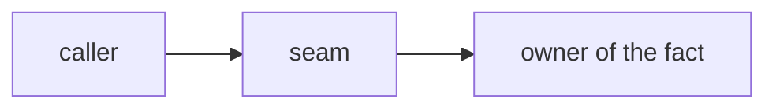

# <Short imperative title> (#<issue>)

Issue: <link> · Base: `origin/<base>` = `<sha>` (stamped <YYYY-MM-DD>) · Precedes/depends: <PRs or "none">

## What changes for the team
<3–6 sentences a non-engineer reads: what the operator sees differently, what stays the same,
what could go wrong. Becomes the PR body's first section, under this same heading.>

## Worktree + branch
- Worktree: `/abs/path/.worktrees/<name>` on `<branch>` off `origin/<base>` = `<sha>`. node_modules + generated client present; run `npx prisma generate` once.
- No branch switching, no `git add/commit/push` (coordinator commits). No subagents. Never run: `scripts/ci-local*`, the full unit suite, whole-repo tsc, `next build`, any integration file. Write the integration cases; the coordinator runs them and pastes RED/GREEN.

## Skills to load (read each `~/.agents/skills/<name>/SKILL.md` before starting)
`tdd`, `verification-before-completion`, `ponytail-review`, `writing-pr-bodies` — plus the task-shape ones from the skill's toolkit table

## Decision being implemented
<Who decided, when, in one paragraph. Link the issue comment. This is a REFACTOR / FEATURE / FIX with exactly N behaviour changes: list them.>

## Architecture
<Owner module of the fact · the seam (what the new code plugs into) · reused vs new · the one derivation · how the next case fits. Graph when >2 modules talk:>

## Pattern to copy — reading order
1. `<path>:<from>-<to>` — <what to take from it>
2. …

## Current state (excerpts)
<Short excerpts with `file:line` so the lane can confirm it is looking at the right code. Drift check: if these do not match the tree, STOP.>

## Scope
### A. <slice>
- <change> (`<file>:<line>`) …
**Interfaces** — Consumes: <exact names/signatures from earlier work>. Produces: <exact names later work relies on>.

### What does NOT change
- <invariant / tempting neighbour / out-of-scope file, each with why>

## Tests (TDD — RED first, paste RED then GREEN)
Acceptance: `<abs path>/LANE-ACCEPT-<issue>.feature` — one it() per Scenario, titles VERBATIM.

### Unit (run these files only)
- `<test file>`: <case> — RED today because <reason>.

### Integration — `<file>` (WRITTEN, not run)
- <case> — fixture: follow `<seeding file>:<from>-<to>`; rows needed: <list>; dates from `<helper>` return value only (it reserves ONE day); stored sign of <effect> is <sign> in the DB; teardown in FK order, guarded against failed setup.

## Steps
1. <one action> → run `<cmd>` → expect `<output>`
2. …

## Done criteria (all must hold)
- [ ] `<cmd>` → <expected>
- [ ] `git status --short` shows only in-scope files
- [ ] scenario → test file:line table in the report

## Simplicity
Ponytail on. Run `/ponytail-review` on your own diff before reporting; fix what it names or say why not.

## Delivery
- eslint on touched files only. tsc only when the coordinator asks.
- Print `LANE-NEEDS-INTEGRATION-SLOT` when the integration cases are written (a progress marker, not the end); then exactly one final line:
  `LANE-DONE-<issue> — <branch> <sha> 
` or `LANE-BLOCKED-<issue> — <what + options>`.
- Write the PR body with `writing-pr-bodies` (its `pr-body-template.md`) to `<abs path>/.worktrees/PR-BODY-<issue>.md`: plain part first, then code, Gate with pasted RED/GREEN, Does NOT change, Ponytail review; `Part of #<issue>`, never `Closes`. The coordinator opens the PR with `--body-file`.
- Report carries: RED + GREEN output, the scenario → test table, the ponytail-review findings, and the path of `PR-BODY-<issue>.md`.

## STOP conditions (LANE-BLOCKED-<issue>)
- <assumption that may be false> — report with options, do not pick.
- Current-state excerpts do not match the tree.
- A step's check fails twice after one honest fix.
- The fix needs an out-of-scope file.
